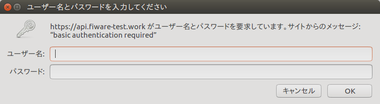
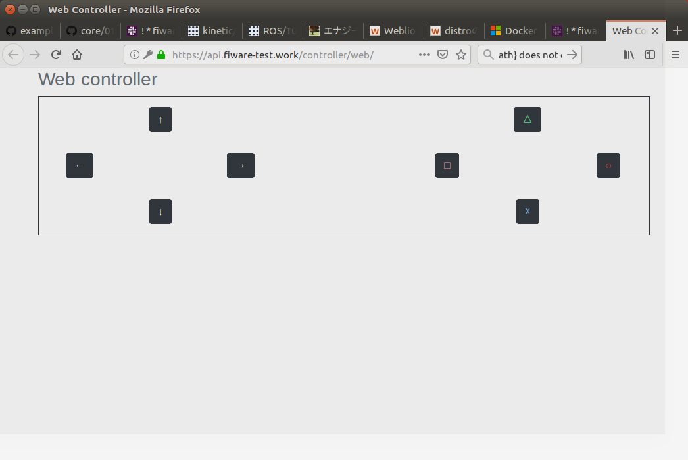
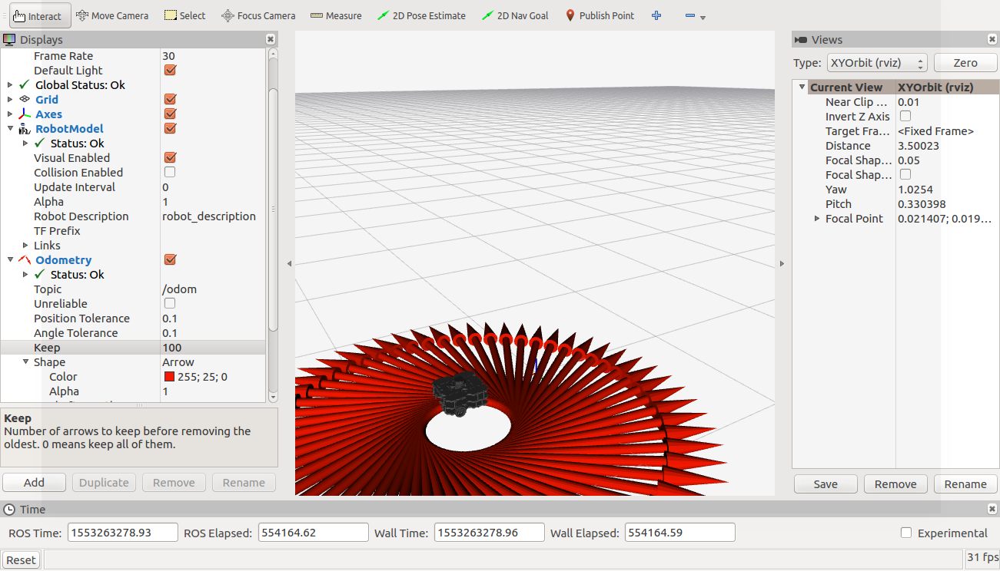
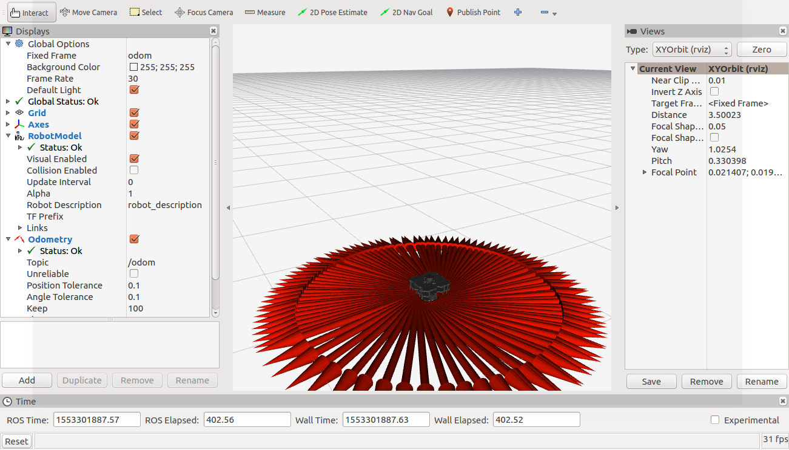

# Turtlebot3 試験環境 インストールマニュアル #6


## 構築環境(2019年3月15日現在)


# WEBコントローラーでturtlebot3を操作


## 環境設定

1. 環境変数の設定

   ```
   $ export CORE_ROOT=$HOME/core
   $ cd $CORE_ROOT;pwd
   ```

    - 実行結果（例）

        ```
        /home/fiware/core
        ```

   ```
   $ export PJ_ROOT=$HOME/example-turtlebot3
   $ cd $PJ_ROOT;pwd
   ```

    - 実行結果（例）

        ```
        /home/fiware/example-turtlebot3
        ```

1. 環境ファイルの実行

    ```
    $ source $CORE_ROOT/docs/azure_aks/env
    $ source $PJ_ROOT/docs/azure_aks/env
    ```


## Webコントローラでturtlebot3を操作

1. web controllerの表示

    ```
    $ xdg-open https://api.${DOMAIN}/controller/web/
    ```


## gamepadでturtlebot3を操作

1. ユーザ名とパスワードの確認

    ```
    $ cat ${CORE_ROOT}/secrets/auth-tokens.json | jq '.[0].settings.basic_auths | map(select(.allowed_paths[] | contains ("/controller/web"))) | .[0].username' -r
    ```

    ```
    $ cat ${CORE_ROOT}/secrets/auth-tokens.json | jq '.[0].settings.basic_auths | map(select(.allowed_paths[] | contains ("/controller/web"))) | .[0].password' -r
    ```

1. turtlebot3の動作確認【turtlebot3-pc】

    1. 「ユーザ名」と「パスワード」を入力し、「OK」をクリック

        

    1. web controllerの「〇」をクリック

        

    1. turtlebot3が移動したことを確認

        


## robotのプログラムを変更

1. fiware-ros-turtlebot3-operator-deployment-acr-wideを削除

    ```
    $ TOKEN=$(cat ${CORE_ROOT}/secrets/auth-tokens.json | jq '.[0].settings.bearer_tokens[0].token' -r)
    $ ./tools/deploy_yaml.py --delete ${PJ_ROOT}/ros/fiware-ros-turtlebot3-operator/yaml/fiware-ros-turtlebot3-operator-deployment-acr-wide.yaml https://api.${DOMAIN} ${TOKEN} ${FIWARE_SERVICE} ${DEPLOYER_SERVICEPATH} ${DEPLOYER_TYPE} ${DEPLOYER_ID}
    ```

    - 実行結果（例）

        ```
        delete /home/fiware/example-turtlebot3/ros/fiware-ros-turtlebot3-operator/yaml/fiware-ros-turtlebot3-operator-deployment-acr-wide.yaml to https://api.example.com
        status_code=204, body=
        ```

1. turtlebot3-operatorのpodを確認【turtlebot3-pc】

    ```
    turtlebot3-pc$ kubectl get pods -l app=turtlebot3-operator
    ```

    - 実行結果（例）

        ```
        No resources found.
        ```

1. fiware-ros-turtlebot3-operator-deployment-acr-narrowを作成

    ```
    $ envsubst < ${PJ_ROOT}/ros/fiware-ros-turtlebot3-operator/yaml/fiware-ros-turtlebot3-operator-deployment-acr-narrow.yaml > /tmp/fiware-ros-turtlebot3-operator-deployment-acr-narrow.yaml
    $ TOKEN=$(cat ${CORE_ROOT}/secrets/auth-tokens.json | jq '.[0].settings.bearer_tokens[0].token' -r)
    $ ./tools/deploy_yaml.py /tmp/fiware-ros-turtlebot3-operator-deployment-acr-narrow.yaml https://api.${DOMAIN} ${TOKEN} ${FIWARE_SERVICE} ${DEPLOYER_SERVICEPATH} ${DEPLOYER_TYPE} ${DEPLOYER_ID}
    $ rm /tmp/fiware-ros-turtlebot3-operator-deployment-acr-narrow.yaml
    ```

    - 実行結果（例）

        ```
        apply /tmp/fiware-ros-turtlebot3-operator-deployment-acr-narrow.yaml to https://api.example.com
        status_code=204, body=  
        ```

1. turtlebot3-operatorのpodを確認【turtlebot3-pc】

    ```
    turtlebot3-pc$ kubectl get pods -l app=turtlebot3-operator
    ```

    - 実行結果（例）

        ```
        NAME                                   READY     STATUS    RESTARTS   AGE
        turtlebot3-operator-7bd5895459-m544p   1/1       Running   0          1h
        ```

1. turtlebot3の動作確認【turtlebot3-pc】

    1.  web controllerの「〇」をクリック

        

    1. turtlebot3が移動したことを確認（先ほどより小さい円で動作）

        

1. fiware-ros-turtlebot3-operator-deployment-acr-narrowを削除

    ```
    $ TOKEN=$(cat ${CORE_ROOT}/secrets/auth-tokens.json | jq '.[0].settings.bearer_tokens[0].token' -r)
    $ ./tools/deploy_yaml.py --delete ${PJ_ROOT}/ros/fiware-ros-turtlebot3-operator/yaml/fiware-ros-turtlebot3-operator-deployment-acr-narrow.yaml https://api.${DOMAIN} ${TOKEN} ${FIWARE_SERVICE} ${DEPLOYER_SERVICEPATH} ${DEPLOYER_TYPE} ${DEPLOYER_ID}
    ```

    - 実行結果（例)

        ```
        delete /home/fiware/example-turtlebot3/ros/fiware-ros-turtlebot3-operator/yaml/fiware-ros-turtlebot3-operator-deployment-acr-narrow.yaml to https://api.example.com
        status_code=204, body=
        ```

1. turtlebot3-operatorのpodを確認【turtlebot3-pc】

    ```
    turtlebot3-pc$ kubectl get pods -l app=turtlebot3-operator
    ```

    - 実行結果（例)

        ```
        No resources found.
        ```

1. fiware-ros-turtlebot3-operator-deployment-acr-wideを作成

    ```
    $ envsubst < ${PJ_ROOT}/ros/fiware-ros-turtlebot3-operator/yaml/fiware-ros-turtlebot3-operator-deployment-acr-wide.yaml > /tmp/fiware-ros-turtlebot3-operator-deployment-acr-wide.yaml
    $ TOKEN=$(cat ${CORE_ROOT}/secrets/auth-tokens.json | jq '.[0].settings.bearer_tokens[0].token' -r)
    $ ./tools/deploy_yaml.py /tmp/fiware-ros-turtlebot3-operator-deployment-acr-wide.yaml https://api.${DOMAIN} ${TOKEN} ${FIWARE_SERVICE} ${DEPLOYER_SERVICEPATH} ${DEPLOYER_TYPE} ${DEPLOYER_ID}
    $ rm /tmp/fiware-ros-turtlebot3-operator-deployment-acr-wide.yaml
    ```

    - 実行結果（例）

        ```
        apply /tmp/fiware-ros-turtlebot3-operator-deployment-acr-wide.yaml to https://api.example.com
        status_code=204, body=
        ```

1. turtlebot3-operatorのpodを確認【turtlebot3-pc】

    ```
    turtlebot3-pc$ kubectl get pods -l app=turtlebot3-operator
    ```

    - 実行結果（例)

        ```
        NAME                                 READY     STATUS    RESTARTS   AGE
        turtlebot3-operator-b5c598bb-7bdnb   1/1       Running   0          35s
        ```

1. turtlebot3の動作確認【turtlebot3-pc】 

    1. web controllerの「〇」をクリック

        

    1. turtlebot3が移動したことを確認

        